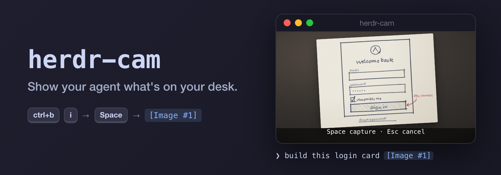
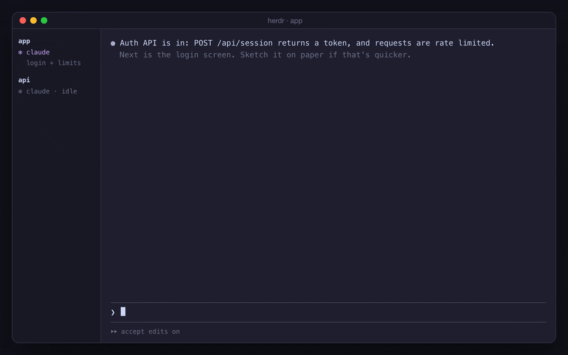

<p align="center">
  
</p>

<p align="center">
  <a href="https://github.com/rchougule/herdr-cam/actions/workflows/ci.yml"></a>
  
  
  
  <a href="LICENSE"></a>
</p>

# herdr-cam

Some things are easier to show than to type. herdr-cam is a [herdr](https://herdr.dev)
plugin that puts your webcam one keystroke away from your coding agent: press `prefix+i`,
hold up a page, press `Space` for each photo and `Enter` to send them. They land in the
agent's prompt as images.

<p align="center">
  
  <br><sub>Rendered illustration of the flow (source in <code>assets/src/</code>). The key presses, window, and prompt behave as shown.</sub>
</p>

```
  before                                      after
  ──────                                      ─────
  open Photo Booth, take the photo            prefix+i   camera window opens
  ⌘C                                          Space      photo (again for more)
  switch back, find the right pane            Enter      all of them in the prompt
  ctrl+V, repeat for every page                          as [Image #1] [Image #2]
```

## What people show their agent

- **Paper sketches.** A wireframe drawn in a minute: "build this layout".
- **Handwritten work.** A dry run, a derivation, a formula worked by hand: "check my steps".
- **Whiteboards.** An architecture diagram after a meeting.
- **Physical screens.** An error on a device display, a blinking status LED, a boot
  message on a machine with no network.
- **Hardware.** A breadboard, a pinout label, a serial number on the back of a router.
- **Printed pages.** A textbook exercise, a printed spec, a code listing in a book.

An iPhone works as the camera too, through Continuity Camera. Its Desk View mode turns it
into a document camera pointed at the desk.

## Install

Needs macOS 14+, herdr 0.9.1+, and the Xcode Command Line Tools 15 or newer
(`xcode-select --install`), because the install step compiles the camera app. It builds
natively on Apple Silicon and Intel.

```sh
herdr plugin install rchougule/herdr-cam
```

Bind it in `~/.config/herdr/config.toml`. `prefix+i` is free in herdr's default keymap.

```toml
[[keys.command]]
key = "prefix+i"                      # ctrl+b, then i
type = "plugin_action"
command = "rchougule.cam.capture"
description = "Photo into this pane"
```

```sh
herdr server reload-config
herdr plugin action invoke rchougule.cam.doctor    # shows "doctor: all good" as a notification
```

The first capture asks for camera access for **HerdrCam**. Allow it once.

## Usage

Focus the pane running your agent and press `prefix+i`. A window opens with a live
preview of the photo's framing.

| Key | In the camera window |
| --- | --- |
| `Space` | Take a photo and add it to the tray (thumbnails, top left) |
| `Enter` | Send every photo in the tray. With an empty tray, take one photo and send it |
| `Delete` | Drop the last photo |
| `T` | Take a photo after a 3 second countdown, for when both hands hold the page |
| `C` | Next camera: built-in, external, iPhone, Desk View |
| `M` | Mirror the preview (photos are never mirrored, so text stays readable) |
| `Esc` / `Q` | Close and discard everything |

The photos are pasted, not sent: add your question and press Enter yourself. The window
closes on its own after 3 minutes without a key press, so the camera is never left on.
Your camera and mirror choices are remembered.

## Agent support

| Agent | What arrives |
| --- | --- |
| Claude Code | Image attachments, `[Image #1] [Image #2]` |
| Codex | The file paths as text; ask Codex to look at them |
| Anything else | The file paths, pasted at the cursor |

## Settings

Optional. Put `KEY=VALUE` lines in `$(herdr plugin config-dir rchougule.cam)/config.env`.
The file is read as plain settings, never run. A value out of range keeps the default and
is reported in a notification and by `doctor`.

| Key | Default | Meaning |
| --- | --- | --- |
| `MAX_EDGE` | `2048` | Long edge of a saved photo in pixels, 64 to 8192. Claude downscales past ~1568 anyway |
| `QUALITY` | `0.85` | JPEG quality, above 0 and at most 1 |
| `TIMER` | `3` | Countdown seconds for `T`, 1 to 30 |
| `KEEP_DAYS` | `30` | Delete photos older than this, checked on each capture. `0` keeps everything |

## Troubleshooting

**`doctor` shows a problem.** The notification gives the count; the full report is in
`herdr plugin log list --plugin rchougule.cam`.

**Nothing happens on `prefix+i`.** Run `doctor`. Check the keybinding is in
`config.toml` and that you ran `herdr server reload-config`. The plugin's log is
`~/.local/state/herdr/plugins/rchougule.cam/herdr-cam.log`.

**"Camera access is off for HerdrCam."** You chose Don't Allow, and macOS will not ask
again. Turn HerdrCam on in System Settings > Privacy & Security > Camera, then press the
key again. To start over: `tccutil reset Camera dev.rchougule.herdr-cam`.

**Asked for camera access again after an update.** Expected: macOS ties the permission to
the exact build, and an update rebuilds the app. Allow it once more.

**"Could not paste into pane …"** The pane closed, or herdr was restarted, while the
window was open. The photos are kept in the captures folder named in the message.

## Privacy

- No network code and no telemetry. The plugin talks only to your local herdr server.
- The camera runs only while the window is open, with macOS's green indicator on, and the
  window closes itself after 3 minutes idle.
- Photos are saved under `~/.local/state/herdr/plugins/rchougule.cam/captures/`, readable
  only by your user, stripped of location and camera metadata, and deleted after
  `KEEP_DAYS`. Photos you discard are deleted right away.
- Your clipboard is never touched, and nothing is sent until you press Enter. Once you
  do, the images go to your agent's model provider like anything else you send.

More in [SECURITY.md](SECURITY.md).

## How it works

```
 prefix+i ─▶ herdr plugin action ─▶ bin/herdr-cam
                                       │  remembers the focused pane
                                       ▼
                              HerdrCam.app (Swift, AVFoundation)
                              live preview, Space adds, Enter sends
                                       │  JPEGs, metadata stripped
                                       ▼
          herdr socket: pane.send_input (one bracketed paste of the file paths)
                                       │
                                       ▼
            Claude Code turns the pasted paths into [Image #1] [Image #2]
```

The camera window is a small native app with its own camera permission, opened for each
capture and closed after. Details in [docs/DEVELOPMENT.md](docs/DEVELOPMENT.md).

## Update and uninstall

```sh
herdr plugin install rchougule/herdr-cam --yes     # reinstalling updates it
herdr plugin uninstall rchougule.cam
tccutil reset Camera dev.rchougule.herdr-cam       # optional: forget the camera grant
```

## Limits

- macOS only; the camera app is AppKit and AVFoundation.
- One camera window at a time. A second `prefix+i` brings the open one forward.
- Up to 10 photos per send.

## FAQ

**Why a native window and not a preview inside the terminal?** A live camera preview
needs a steady frame rate to aim a page at; terminal image protocols are too slow for
that.

**Does it work over SSH or with a remote herdr?** No. The camera and the agent pane need
to be on the same Mac.

**Can it paste into the clipboard instead?** Not today. Pasting paths keeps your clipboard
intact and works with any agent that reads image paths.

## Contributing

Issues and pull requests are welcome. [docs/DEVELOPMENT.md](docs/DEVELOPMENT.md) covers the
layout, the capture flow, and the test suites; `sh scripts/test.sh` runs everything that
needs no camera. For bugs, include the `doctor` output (the issue template asks for it).

## License

[MIT](LICENSE) © 2026 Rohan Chougule
